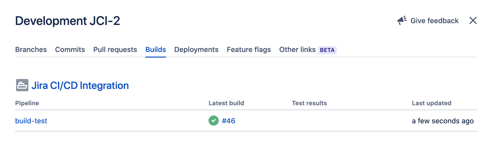
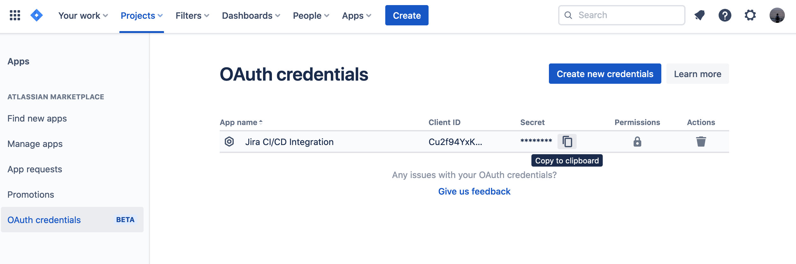

# Jira Development Integration

Integrate your codefresh pipeline's Build and Deployment information into the Jira Development Panel.



> Only supports Jira Cloud. Does not support Jira Server (hosted)

> Based on https://github.com/rohit-gohri/jira-ci-cd-integration.git

## Prerequisites

### Generate Credentials

Generate new OAuth Credentials and copy

**See:** <https://support.atlassian.com/jira-cloud-administration/docs/integrate-with-self-hosted-tools-using-oauth/>



## How to use

[](https://cloud.drone.io/rohit-gohri/jira-ci-cd-integration)

Add secrets for `JIRA_CLIENT_ID` and `JIRA_CLIENT_SECRET` and then add this to your pipeline:

```yaml
steps:
  - name: jira-integration
    image: boringdownload/jira-integration:v0
    environment:
      BUILD_NAME: drone-pipeline # or give any custom name
      JIRA_INSTANCE: companyname
      JIRA_CLIENT_ID:
        from_secret: jira_client_id
      JIRA_CLIENT_SECRET:
        from_secret: jira_client_secret
```

To send deployment information just promote the build and it will send a deployment info.


## Options

Provide these options via environment variables, or directly in case of Github Actions.

### Inputs

#### jira_instance: JIRA_INSTANCE

Sub Domain of Jira Cloud Instance. This part of the url: `https://<jira_instance>.atlassian.net`

#### client_id: JIRA_CLIENT_ID

ClientID of OAuth Creds

#### client_secret: JIRA_CLIENT_SECRET

Client Secret of OAuth Creds

#### event_type: JIRA_EVENT_TYPE (optional)

"build" or "deployment", (default is "build"). You can override this manually or just provide an `evironment` to send a deployment event instead of a build event.

#### state: BUILD_STATE (optional)

"successful"/"success", "failed", or "canceled" (default is "successful").

We try to detect this via [env-ci](https://github.com/semantic-release/env-ci) for most CI/CD providers, but you can manually override it if you wish to do so.

#### issue: JIRA_ISSUES (optional)

Will be parsed from branch name automatically if available. Or you can provide it according to your own logic. Can be multiple comma separated issues.

### Pipeline Info

We try to detect this via [env-ci](https://github.com/semantic-release/env-ci) for most CI/CD providers, but you can manually override it if you wish to do so.

#### Commit Message: COMMIT_MESSAGE

If the tool can't detect your commit message you may provide a value directly. If you have the jira id in the commit message, it will be parsed.

#### Pipeline Name: BUILD_NAME

A custom name for your pipeline

#### Environment Name: BUILD_ENVIROMENT (optional)

> NOTE: Only for Deployment events

A name for your environment. The tool tries to automatically infer this from your CI/CD provider.

#### Environment Type: BUILD_ENVIROMENT_TYPE (optional)

> NOTE: Automatically inferred from environment name

The tool tries to automatically parse this from environment but if you want to override then provide one of (`unmapped`, `development`, `testing`, `staging`, `production`)

## Contributing

Feel free to open issues/Pull Requests to add support for some CI provider that doesn't have support yet.

## License

[MIT License. Copyright (c) 2022 Rohit Gohri](./LICENSE)
